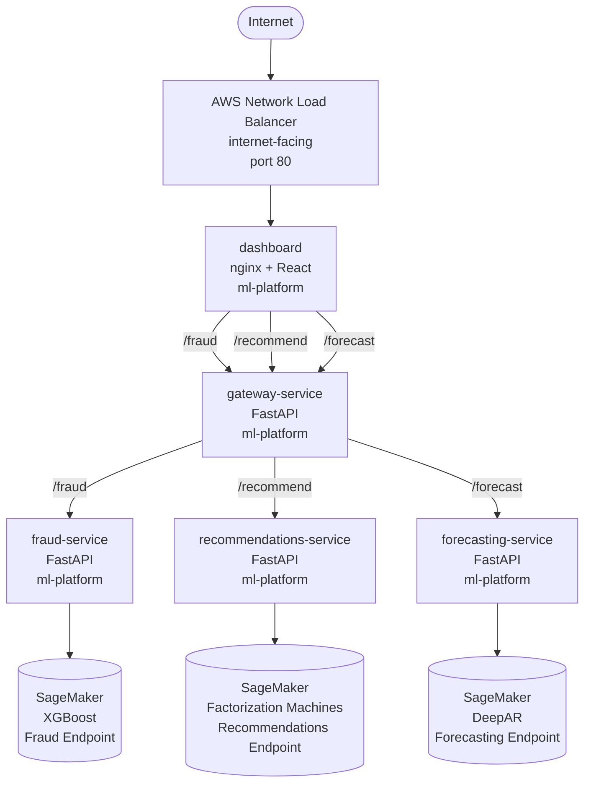

# ML Platform Architecture

## Diagram

## Infrastructure
- EKS Cluster: k8s-training-cluster (us-east-1)
- Node Group: student-nodes (2x t3.medium)
- Namespaces: ml-platform
- State Backend: S3 (cams-tf-state-assessment-4) + DynamoDB lock

## Namespaces
| Namespace   | Services                                                       |
|-------------|----------------------------------------------------------------|
| ml-platform | gateway, fraud, recommendations, forecasting, dashboard  |

## SageMaker Endpoints
| Endpoint                         | Model              | Algorithm |
|----------------------------------|--------------------|-----------|
| cams-fraud-endpoint-1771690056   | Fraud Detection    | XGBoost   |
| cams-recommendations-endpoint-v2 | Recommendations    | FM        |
| cams-forecasting-endpoint-v2     | Demand Forecasting | DeepAR    |

## Resource Controls (ml-platform namespace)
| Resource  | Request | Limit |
|-----------|---------|-------|
| CPU       | 4       | 8     |
| Memory    | 4Gi     | 8Gi   |
| Max Pods  | 30      | -     |
