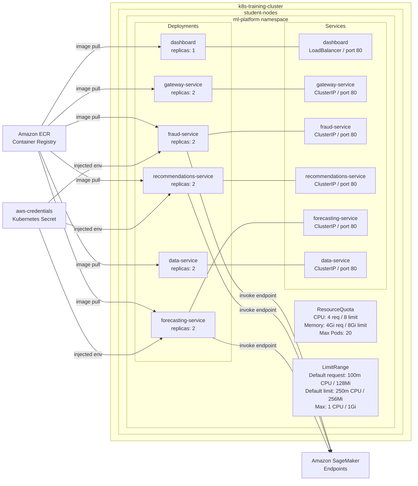

# Kubernetes Architecture

## Cluster Diagram

> **Presentation Notes:**
> Start by orienting the audience to the two outer boundaries — the EKS cluster and the node group.
> "This is our EKS cluster running in us-east-1. All workloads run on a managed node group called student-nodes, backed by two t3.medium EC2 instances."
>
> Point to the namespace boundary next.
> "Everything is scoped to the ml-platform namespace. Namespaces give us isolation, and more importantly they let us enforce resource controls at the boundary level rather than per-pod."
>
> Point to ResourceQuota and LimitRange.
> "We have two resource control mechanisms in place. The ResourceQuota caps the total CPU and memory the entire namespace can consume — this prevents one team from starving the rest of the cluster. The LimitRange sets default requests and limits on any container that does not specify them — this prevents unbounded containers from being scheduled."
>
> Move to Deployments.
> "Each service is its own Deployment. Most run two replicas for availability. Every pod has both a liveness probe and a readiness probe — liveness tells Kubernetes when to restart a container, readiness tells it when the pod is ready to receive traffic."
>
> Move to Services.
> "Each Deployment is backed by a Kubernetes Service. The dashboard is exposed as a LoadBalancer which provisions an AWS NLB and gives us a public endpoint. Everything else is ClusterIP — internal only, not reachable from outside the cluster."
>
> Point to ECR arrows.
> "All images are pulled from Amazon ECR. This is our private container registry — no public images in production."
>
> Point to the Secret and its connections.
> "The fraud, recommendations, and forecasting services need to call SageMaker. Rather than baking credentials into the image, we inject them at runtime via a Kubernetes Secret. The pods read the credentials from environment variables — nothing sensitive ever lives in the container image."
>
> Point to the SageMaker arrows.
> "Finally, the three ML services call their respective SageMaker endpoints directly. Each service owns exactly one endpoint — fraud calls the XGBoost endpoint, recommendations calls the FM endpoint, forecasting calls the DeepAR endpoint. There is no shared endpoint, no ambiguous routing."

## Cluster Details

| Property       | Value                |
|----------------|----------------------|
| Cluster Name   | k8s-training-cluster |
| Region         | us-east-1            |
| Node Type      | t3.medium            |
| Node Count     | 2                    |
| K8s Version    | 1.32                 |

## Namespace: ml-platform

### Resource Controls

| Control       | Setting                           |
|---------------|-----------------------------------|
| ResourceQuota | CPU: 4 req / 8 limit              |
| ResourceQuota | Memory: 4Gi req / 8Gi limit       |
| ResourceQuota | Max Pods: 20                      |
| LimitRange    | Default request: 100m CPU / 128Mi |
| LimitRange    | Default limit: 250m CPU / 256Mi   |
| LimitRange    | Max: 1 CPU / 1Gi                  |

### Deployments

| Deployment              | Replicas | Probes               | Image Source |
|-------------------------|----------|----------------------|--------------|
| dashboard               | 1        | liveness + readiness | ECR          |
| gateway-service         | 2        | liveness + readiness | ECR          |
| fraud-service           | 2        | liveness + readiness | ECR          |
| recommendations-service | 2        | liveness + readiness | ECR          |
| forecasting-service     | 2        | liveness + readiness | ECR          |
| data-service            | 2        | liveness + readiness | ECR          |

### Services

| Service                 | Type         | Port | Target        |
|-------------------------|--------------|------|---------------|
| dashboard               | LoadBalancer | 80   | pod port 80   |
| gateway-service         | ClusterIP    | 80   | pod port 8000 |
| fraud-service           | ClusterIP    | 80   | pod port 8000 |
| recommendations-service | ClusterIP    | 80   | pod port 8000 |
| forecasting-service     | ClusterIP    | 80   | pod port 8000 |
| data-service            | ClusterIP    | 80   | pod port 8000 |

### AWS Credentials

AWS credentials are injected into fraud-service, recommendations-service,
and forecasting-service via a Kubernetes Secret (aws-credentials).
This allows the pods to authenticate with SageMaker at runtime
without hardcoding credentials in the image.
